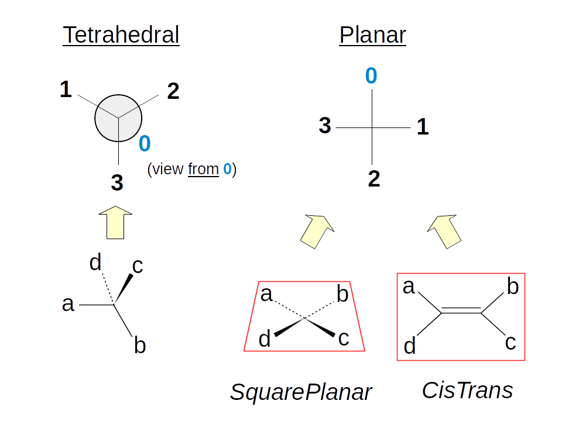
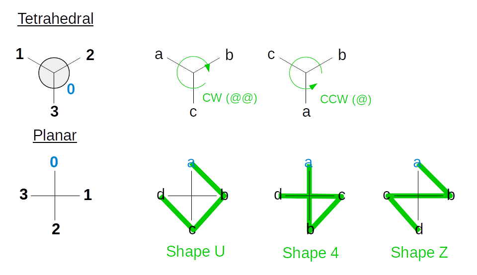
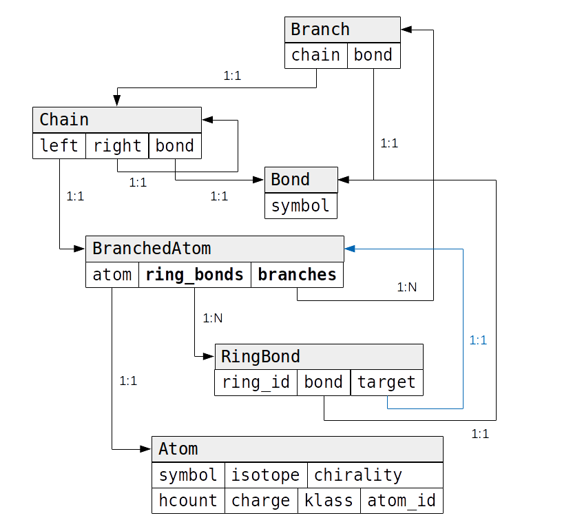

SMILES
======

About SMILES
++++++++++++

SMILES (simplified molecular input entry system) is a "chemical notation system designed for modern chemical information processing" invented by Weininger (see sources) and then developed by Daylight Chemical Information Systems (simply referred as "Daylight" is most websites).
There is also `an open standard <http://opensmiles.org/opensmiles.html>`_ specification that we will follow here.

A SMILES string is basically a linear representation of a molecule created from a traversal of the molecular graph (in its simplest version, a labeled graph whose vertices are the atoms and edges are the chemical bonds).
This is actually equivalent to the construction of a `spanning tree <https://en.wikipedia.org/wiki/Spanning_tree>`_.
Therefore, many SMILES are possible (including very peculiar ones) for a given molecule (depending, basically on the starting vertex, and on the edges taken during the visit).

To handle this, people propose canonicalization schemes, that consists in two parts:

1. Renumber the atoms (the vertices of the graph) based on some invariant(s), in a way that is (normally) unique ;
2. Starts by the atom with the lowest number out of the previous step, and perform some branching decision during the exploration (once again, in a *unique* way).

The critical part is actually the first one.
For example, the algorithm developed by Weininger in 1989 (CANGEN) fails for some structures (see Neglur *et al.* in references).

About "stereochemistry"
+++++++++++++++++++++++

**TL;DR:**  SMILES is not about absolute stereochemistry (in the CIP sense), it is local stereochemistry.

Background
__________

Implementation of the stereo perception is directly inspired by `OpenBabel implementation of stereoconcepts <http://openbabel.org/dev-api/classOpenBabel_1_1OBStereoBase.shtml>`_, which was implemented in the same spirit as SMILES.
In SMILES (and therefore here), one only cares about **local** stereochemistry: even though a carbon may not be asymetric (in the CIP sense), it may present a **local** configuration.
There is therefore **no** correspondence between the configuration in a SMILE string and the absolute configuration (although if the vertex are given in the correct order in the CIP way, that corresponds to R/S stereo configuration for tetrahedral carbons).
One only cares about the correspondance between the vertices, given in a certain order, and the "reality" of the structure.

In practice
___________

Stereochemistry is defined for any set of 4 atoms that contains at most 1 hydrogen (non-planar) or 2 (planar).
The implementation should recognize at least two kind of stereochemistry:

+ Planar stereo config (cis/trans for alcenes, square planar) ;
+ Non planar stereo config (clockwise/anticlockwise for "asymetric" carbons).

The purpose of this stereo implementation is to match the set of indices *a, b, c and d* (which may be given in any order) with the set *0, 1, 2 and 3*.
The value of the stereo object is the order in which the *a, b, c and d* indices must be read to match *0, 1, 2 and 3*.

For the non planar stereo configuration, there is two possible values: clockwise (``@@``) and counterclockwise (``@``).
For the planar stereo configuration, there is three possible values: ``U``, ``Z`` and ``4``.

    The question is always "how to read ``(a,b,c,d)`` so that the sequence matches ``(0,1,2,3)``".
    To do so, the first part is to set a ``start`` atom (the others are the ``refs`` in the implementation) and set the corresponding ``value``.

Implementation details
++++++++++++++++++++++

The actual implementation uses the classic approach of a `top-down parser <https://en.wikipedia.org/wiki/Top-down_parsing>`_ (more specifically, a kind of `recursive descent parser <https://en.wikipedia.org/wiki/Recursive_descent_parser>`_), and the code is greatly inspired by this `wonderful series of blog posts <https://ruslanspivak.com/lsbasi-part1/>`_ by Ruslan Spivak on parsing and interpreting source code.
So,

1. Lexical analysis using the `Lexer class <api/lexer.html#osmipy.lexer.Lexer>`_, which cuts the input string into tokens (`Token class <api/tokens.html#osmipy.tokens.Token>`_) ;
2. Syntaxic analysis using the `Parser class <api/parser.html#osmipy.parser.Parser>`_, which turns the stream of tokens into an abstract syntax tree (`AST class <api/smiles_ast.html#osmipy.smiles_ast.AST>`_ and children).
3. On top of that, the `SMILES class <api/smiles.html#osmipy.smiles.SMILES>`_ generate the AST from a string and validates it.
   For the other way around, the interpretation is done with the `Interpreter class <api/smiles.html#osmipy.smiles.Interpreter>`_, which turns an AST into a SMILES string (still implementing the visitor pattern).

.. note::

    Due to so called ring bonds (``ring_bond``), the parser would need backtracking to differentiate it with chain.
    This is avoided by a (rather complicated) different implementation of ``chain()`` and ``branched_atom()``:

    .. code-block:: text

        branched_atom' := atom ring_id* ;
        chain' := branched_atom' ring_bond* branch* ((bond | DOT)? chain')? ;

The relation between the AST objects is given by the following figure:

    Flowchart of the different AST objects.
    Note that the ``parent`` attributes is set at the initialization of the object

A ``Chain`` is a succession of ``BranchedAtom``, but those can have ``Branch`` (other chains) or ``RingBond`` (loops in the graph).

The ``BranchedAtom`` also contains an ``Atom``, which stores informations about it (symbol, charge, local chirality, ...).
Note that the ``atom_id`` field is only there to help interaction with higher-level libraries, and should not be considered as *unique* (except if the validator is used, which checks the uniqueness).

Grammar and parsing
+++++++++++++++++++

The grammar used by this implementation is derived from the work done in `OpenSMILES <http://opensmiles.org/opensmiles.html>`_, but some rules where slightly modified (``chain`` use left recursion rather than right and ``ringbond`` was modified).

.. literalinclude:: ./grammars/smiles.txt
  :caption: :download:`./grammars/smiles.txt`

Unless stated otherwise, this implementation follows the open specification, except:

+ All the ``aromatic_element`` is fully included in the ``organic_subset`` (so that ``se`` and ``as`` can be used without brackets) ;
+ Square planar (``@SP``), bipyramidal (``@TB``) and octahedral (``@OH``) chirality are not implemented (not even in the grammar) ;
+ There is not check of the aromaticity (or not) yet (that should go into ``Validation``) ;
+ Implicit hydrogen count (for element of the so-called *organic* subset) is not always correct (especially with aromaticity, for example the nitrogen in ``n1ccccc1``) ;
+ The output is not *standardized* (nor *canonical*), especially concerning cycles and "removing chiral marking on atoms that are not" (that should go into ``Validation``) ;
+ There is not (yet?) way to allow *non-standard* (loosy) SMILES inputs!

Sources
+++++++

+ `Wikipedia page of SMILES <https://en.wikipedia.org/wiki/Simplified_molecular-input_line-entry_system>`_ ;
+ `The OpenSMILES specification <http://opensmiles.org/opensmiles.html>`_ ;
+ `Daylight's explanation page of SMILES <http://www.daylight.com/dayhtml/doc/theory/theory.smiles.html>`_ ;
+ A page to test SMILES: `CACTVS GIF/PNG-Creator on the NIH website <https://cactus.nci.nih.gov/gifcreator/>`_ ;
+ `Marvin documentation of SMILES <https://chemaxon.com/marvin-archive/6.0.3/marvin/help/formats/smiles-doc.html>`_  (in which they declare to use CANGEN) ;
+ `Details on OpenBabel implementation of SMILES <http://openbabel.org/dev-api/canonical_code_algorithm.shtml>`_ ;
+ D\. Weininger *J. Chem. Inf. Comput. Sci.* **28**, 31 (1988) `10.1021/ci00057a005 <https://dx.doi.org/10.1021/ci00057a005>`_ ;
+ D\. Weininger *et al*. *J. Chem. Inf. Comput. Sci.* **29**, 97 (1989) `10.1021/ci00062a008 <https://dx.doi.org/10.1021/ci00062a008>`_ ;
+ K\. K. Agarwal *et al.* *J. Chem. Inf. Comput. Sci.* **34**, 463 (1994) `10.1021/ci00019a001 <https://dx.doi.org/10.1021/ci00019a001>`_ ;
+ G\. Neglur *et al.* "Assigning Unique Keys to Chemical Compounds for Data Integration: Some Interesting Counter Examples" in *Data Integration in the Life Sciences*, 145–157 (Springer, Berlin, Heidelberg, 2005) `10.1007/11530084_13 <https://dx.doi.org/10.1007/11530084_13>`_ ;
+ N\. M. O'Boyle *J. Cheminf.* **4**, 22 (2012)  `10.1186/1758-2946-4-22 <https://dx.doi.org/10.1186/1758-2946-4-22>`_ ;
+ Details on the `canonicalization algorithm of InCHI <http://depth-first.com/articles/2006/08/12/inchi-canonicalization-algorithm/>`_ (actually similar to the one of Agarwal) ;

