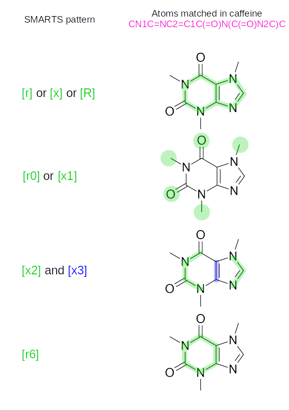

WIP: SMARTS
===========

.. warning::

    This is a *work in progress*, for an eventual implementation of SMARTS into the library, for pattern matching.
    This is a preliminary documents for the main idea between a possible implementation, in the same way as the OpenSMILES specification (but let's be honest, not that good).

Theory
------

SMARTS (SMILES arbitrary target specification) is "language for specifying substructural patterns in molecules".
It is therefore an extension to SMILES, which adds tools to define a pattern (logical operators and atom and bonds types) to match a target.
But the purpose is different: SMILES represent a molecular system (within the valence model), SMARTS may not represent a valid molecule in itself (for example, ``cc`` is not a valid SMILES string) but a pattern (``cc`` will match ``c1[nH]ccc1`` or ``c1ccccc1``).

Pattern matching implies:

+ Either checking that there is at least one match in the SMILES string ;
+ Or getting the set of all group of atom that the pattern matched (there maybe multiple matches inside a given SMILES string).

Grammar
+++++++

The grammar presented here is close to the one of SMILES `presented here <about-smiles.html#grammar-and-parsing>`_:

.. literalinclude:: ./grammars/smarts.txt
  :caption: :download:`./grammars/smarts.txt`

The logical operators add a layer of complexity to the grammar, but keep in mind that "almost all SMILES specification are valid SMARTS [targets]".

Semantic
++++++++

There is no definition, like for SMILES, of SMARTS.
Also, I find the pages of Daylight and OpenEye on the subject quite fuzzy on different topics, so I will try to expend a bit what I did understand (and implement) out of that.

Atomic properties
_________________

.. warning::

    In SMILES, default values were assumed for the properties of atoms without square brackets.
    In SMARTS, a property is not defined, then **it is not part of the pattern**, and will therefore match **any** of the value of the given properties (including none).

Atom
****

An atom is matched by its symbol, and the rule for this symbol are the same than in SMILES (only the atoms in the organic subset are allowed to be used without square brackets).

Instead of the atom symbol, the atomic number can be used with the ``'#'`` symbol, followed by the atomic number, inside square brackets (outside, it would be confused with the triple bond symbol).
It may be used to select an atom, no matter if it is aromatic or not.

For example:

.. list-table::
   :header-rows: 1

   * - SMILES string
     - SMARTS pattern
     - Match?
   * - ``CCO``
     - ``C`` (or ``[C]``)
     - Yes (for both carbons)
   * - ``c1ccccc1``
     - ``C`` (or ``[C]``)
     - **No**
   * - ``c1cc(CO)ccc1``
     - ``c`` (or ``[c]``)
     - Yes (but only the aromatic carbons)
   * - ``c1cc(CO)ccc1``
     - ``C`` (or ``[C]``)
     - Yes (but only the aliphatic carbon)
   * - ``C``
     - ``[#6]``
     - Yes
   * - ``c1cc(CO)ccc1``
     - ``[#6]``
     - Yes (for any carbon!)

The wildcard symbol (the ``'*'`` symbol) matches every atom (while it was an unknown atom in SMILES).

SMARTS adds two other simple wildcard atoms: ``a``, which matches any aromatic atom, and ``A``, which matches the aliphatics ones:

+ Aliphatic atoms: ``B``, ``C``, ``N``, ``O``, ``S``, ``P``, ``F``, ``Cl``, ``Br``, ``I`` ;
+ Aromatics atoms: ``b``, ``c``, ``n``, ``o``, ``p``, ``s``, ``se``, ``as``.

Those 3 wildcards can be written without square brackets.

Examples:

.. list-table::
   :header-rows: 1

   * - SMILES string
     - SMARTS pattern
     - Match?
   * - ``C``
     - ``*`` (or ``[*]``)
     - Yes
   * - ``C``
     - ``A`` (or ``[A]``)
     - Yes
   * - ``C``
     - ``a`` (or ``[a]``)
     - **No**
   * - ``c1[nH]ccc1``
     - ``a``  (or ``[a]``)
     - Yes (for any atom of the cycle)

More complex wildcards, which may take an argument (a digit), can be used to match atom properties.
They are only defined inside square brackets.

There is three wildcards to match the number of connections via different definitions: ``D``, ``X`` and ``v``.

.. list-table::
   :header-rows: 1

   * - Definition
     - Description
     - Default value
   * - ``[X<n>]``
     - Atom with ``n`` connections (including hydrogens)
     - *The argument must be specified*
   * - ``[D<n>]``
     - Atom with ``n`` explicit connections (without implicit or ``hcount`` hydrogens)
     - *The argument must be specified*
   * - ``[v<n>]``
     - Valence (sum of bond orders)
     - *The argument must be specified*

The total valence include implicit or ``hcount`` hydrogens (with which the bond is assumed to be single).
The bond order depends on the bond symbol used (and does not take electron delocalization into account):

.. list-table::
   :header-rows: 1

   * - Bond type
     - Symbol(s)
     - Bond order
   * - Disconnected
     - ``.``
     - 0
   * - Single
     - ``-``, ``/``, ``\`` or implicit
     - 1
   * - Aromatic
     - ``:`` or implicit
     - 1.5
   * - Double
     - ``=``
     - 2
   * - Triple
     - ``#``
     - 3
   * - Quadruple
     - ``$``
     - 4

Examples:

.. list-table::
   :header-rows: 1

   * - SMILES string
     - SMARTS pattern
     - Match?
   * - ``C``
     - ``[X4]``
     - Yes
   * - ``C``
     - ``[D4]``
     - **No**
   * - ``C``
     - ``[v4]``
     - Yes
   * - ``C=C``
     - ``[X3]``
     - Yes (for both carbons)
   * - ``C=C``
     - ``[D3]``
     - **No**
   * - ``C=C``
     - ``[D1]``
     - Yes (for both carbons)
   * - ``C=C``
     - ``[v4]``
     - Yes (for both carbons)

There is, finally, three wildcards to address the specific presence of an atom into a ring: ``x``, ``R`` and ``r``.
The first two are synonyms, since this implementation follows the position of OpenEye over the one of Daylight on SSSR (Smallest Set of Smallest Rings).

.. list-table::
   :header-rows: 1

   * - Definition
     - Description
     - Default value
   * - ``[r<n>]``
     - Atom that is in a ring of size ``n``
     - ``[r]`` is "any ring atom", while ``[r0]`` is "not part of any ring"
   * - ``[x<n>]`` or ``[R<n>]``
     - Atom for which  ``n`` (explicit) connection are part of a ring
     - ``[x]`` is "any ring atom" (same for ``[R]``), while ``[x0]`` is "not bounded to any ring"

To understand (and implement) those wildcards, the first concept is *ring membership*, which is the target of either ``[r]``, ``[R]`` or ``[x]``, which all match **any** atom present in a ring.
A ring is defined as a cycle when there is not bond between the atoms, other than the previous and next: indole is perceived as fused 6 and 5-members rings rather than a 9-membered ring.

The size of the ring in which the atom is present is the specific goal of ``r``: ``[r5]`` matches all the atoms of 5-member rings, while ``[r6]`` does the same for 6-member rings.

On the other hand, the goal of ``x`` (and ``R``) is the number of ring connection: ``[x1]`` matches all the atoms bounded to exactly one atom member of a ring, ``[x2]`` all the atoms bounded to exactly two atoms member of a ring, etc.
Therefore, an atom matched by ``[x<n>]`` (with ``n`` defined) **may not be part of a ring**.

Example on the caffeine molecule:

    Colored atom are matched by the pattern in the same color.
    All colored atoms are matched individually, a continuous line is only used to ease the interpretation.
    Note that ``[x0]`` does not match any atom of this molecule, since they are all bounded or part of a ring.

Other atomic properties
***********************

The isotope can be used to match an atom, for example ``[35]`` matches all atom with an isotope of ``35``.
This only works on atom where the isotope is defined (to avoid getting stuck into the debate of what the isotope for each element should be).
Note that ``0`` is a valid isotope, so that cannot be used to match "any atom without isotope definition" (since the SMILES specification states that "the atom is assumed to have the naturally-occurring isotopic ratios", but this is left to the appreciation of the implementation).

Chirality may be specified using  ``@`` or ``@@`` to match any atom with the given configuration specified.
This property may be followed by a ``?``, which means "or unspecified".
To be matched by ``[@?]`` or ``[@@?]``, and atom needs at most 1 implicit hydrogen and a total of 4 connections (this is therefore equivalent to ``[$([@]),$([!@;X4;H0,H1])]``, see below).
For example, SMARTS ``[@?]`` would match the carbon atom in SMILES ``C(Cl)(Br)O`` (which would not have been matched by ``[@]``), ``[C@H](Cl)(Br)O`` but not ``[C@@H](Cl)(Br)O``.

Hydrogen count may be spectifed: ``[H<n>]`` is the total count of hydrogen (including implicit ones). Note that ``[H]`` is equivalent to ``[H1]`` , to follow the SMILES definition.
SMARTS adds a specific primitive to match only implicit hydrogens: ``[h<n>]``: for example, the SMARTS ``[h]`` (which is equivalent to ``[h1]``, by the same logic) would match any carbon atom in the SMILES ``c1[nH]cccc1``, but not the nitrogen, while SMARTS ``[H]`` would match any atom in this SMILES.
SMARTS  ``[H0]`` is valid, and matches atoms without hydrogen, while ``[h0]`` matches any atom without implicit hydrogen, thus including atom outside the organic subset.

The charge is specified as usual: SMARTS ``[+2]`` matches any doubly positive atom.
The ``[++]`` and ``[--]`` syntaxes are deprecated.
On the other hand, SMARTS ``[+0]`` (or ``[-0]``) is valid and matches atoms without a charge.

Finally, the class may also be used, as in SMILES: SMARTS ``[:2]`` would match the second carbon in SMILES ``[C:1]=[C:2]``.
Since class 0 is set to any atom that does not specify a class (according to the SMILES specification), the SMARTS ``[:0]`` is nearly equivalent to "any atom without a class" (except if the SMILES contains an explicit class 0 definition).

Logical expressions
*******************

To match more than a single atomic property, logical operators can be used.
The resulting logical expression must be written inside square brackets.

.. list-table::
   :header-rows: 1

   * - Precedence
     - Expression
     - Description
   * - 1
     - ``[!e]``
     - Not ``e``
   * - 2
     - ``[e&f]``
     - ``e`` and ``f``
   * - 3
     - ``[e,f]``
     - ``e`` or ``f``
   * - 4
     - ``[e;f]``
     - ``e`` and ``f``

Expression are processed from left to right. Commutativity is assumed.
Since there is no parentheses, the priority rules in the resulting expression is handled via precedence: if an expression is preceded by an operator and followed by another, the operator highest in the list (with the lowest precedence in that table) should be applied first.
Hence,

+ ``[!e,f]`` means "(not ``e``) or ``f``" ;
+ ``[e&f,g]`` means "(``e`` and ``f``) or ``g``", notice the parentheses ;
+ ``[e;f,g]`` means "``e`` and (``f`` or ``g``)", notice the usage of the other form of "and".

Note that the ``&`` operator is the default and may be omitted: SMARTS ``[n&H1]`` and ``[nH1]`` are totally equivalent.

Examples:

.. list-table::
   :header-rows: 1

   * - SMILES string
     - SMARTS pattern
     - Match?
   * - ``COCC(=O)O``
     - ``[O;X2]``
     - Yes (but not the oxygen of the ketone)
   * - ``CC(CO)CC``
     - ``[C;!H3]``
     - Yes (but not the 2 terminal carbons)

Recursive SMARTS
****************

The recursive SMARTS allows to define atomic environment.
In is to be used inside square brackets (this is an atomic property), and have the form ``$(expr)``, where ``expr`` is a valid SMARTS, starting by the atom of interest.
Only the atom of interest (the first one) is matched by the expression.

For example, the SMARTS ``[R0;$(*aaaaO)]`` would match an atom in *para* to the oxygen in an aromatic cycle, i.e. the methyl's carbon in ``c1c(O)ccc(C)c1`` (the `4-methylcresol <https://en.wikipedia.org/wiki/Cresol>`_).

Bonds
_____

Atomic properties can be combined together using bonds to match a group of atoms.

Symbols and wildcards
*********************

Along with the already defined symbols for bonds used in SMILES, there is two wildcards bond defined:  ``~``, which matches any bond and  ``@``, which matches any bond contained in a ring.
Note that a missing bond symbol does is interpreted as "single or aromatic", therefore it is not equivalent to ``~``.

Examples:

.. list-table::
   :header-rows: 1

   * - SMILES string
     - SMARTS pattern
     - Match?
   * - ``c1(C)ccccc1``
     - ``[#6]~[#6]``
     - Yes (all pair of bounded carbons, including the methyl one)
   * - ``c1(C)ccccc1``
     - ``[#6]@[#6]``
     - Yes (all pair of ring carbons, not the methyl one)
   * - ``CC(=O)CC(=O)O``
     - ``[O]``
     - Yes (all the oxygens)
   * - ``CC(=O)CC(=O)O``
     - ``[O;$(O(C=O))]``
     - Yes (but only the oxygen of the carboxylic acid)
   * - ``CC(=O)CC(=O)O``
     - ``C(=O)``
     - Yes (both ``C(=O)`` groups of atoms)
   * - ``CC(=O)CC(=O)O``
     - ``[CX3](=O)[OX2H1]``
     - Yes (the ``C(=O)O`` group of atoms)

Directional bonds (``/`` and ``\``) may be followed by a ``?``, which means "or unspecified".
For example, SMARTS ``O\?C=C\?*`` (trans atoms) matches SMILES ``OC=CCl`` (which would not have been matched by SMARTS ``O\?=C\*``), ``C(/O)=C(\Cl)`` and ``C(\O)=C(/Cl)`` (trans or unspecified molecules) but not ``C(/O)=C(/Cl)`` (cis molecule).
Since it is only possible to determine the relative orientation of two group with respect to each other, the specification of directional bonds should go by pair, and SMARTS ``C(\O)`` is invalid.

Note that dot bonds (``.``) allow to matches the next fragment anywhere in the SMILES string. Therefore, SMARTS ``CC.[OH]`` would match against SMILES strings ``CC(O)=O`` but also ``CCOCO`` (for the last ``O``).

Logic with bonds
****************

It is also possible to use logical operator on bond symbols, with the same symbols and rules as for the logical combination of atomic properties, except that the ``&`` is not implicit.

For example,

+ SMARTS ``*@;!:*`` should be interpreted as "any pair of atom connected by (a ring AND not an aromatic) bond" ;
+ SMARTS ``[#6]=,#[#6]`` should be interpreted as "any pair of carbon connected by (a double OR triple) bond".

Order
*****

Since the bonds are not directional and since the goal with SMARTS is to match a part of the tree that represent the SMILES string, order does not matter.
For example, SMARTS ``CBr`` should match SMILES ``C(O)Br``, ``C(Br)O``, ``Br(CO)`` (so the order of the branches does not matter), ``C(/Br)=C(\O)`` (directional bond is a single bond) and ``C1C2C1.Br2`` (ring bonds does works).

Simplifications
_______________

The goal here is not to get an *unique* SMARTS, but an efficient one.

Note that since logical operators are used, a few basic rules holds:

1. Commutativity: ``[a;b]`` is equivalent to ``[b;a]`` ;
2. Distributivity: ``[a&b,a&c]`` is equivalent to ``[a;b,c]`` (but notice the change of precedence) and ``a,b;a,c`` is equivalent to ``[a,b&c]`` (with a change of precedence as well) ;
3. Absorption: ``[a;a,b]`` is equivalent to ``[a]`` and ``[a,a&b]`` is also equivalent to ``[a]``.

For efficiency consideration, and since SMARTS string should be processed left-to-right, also recall that:

+ In a "and-expression", if any expression is false, then the whole expression is false.
  Therefore, "uncommon" pattern should be placed **first**.
+ In a "or-expression", if any of the expression is true, then the whole expression is true.
  Therefore, "uncommon" pattern should be place **last**.

"Uncommon" patterns means expressions that are rare in the considered SMILES strings.
Order by increasing rarity (and a bit arbitrary) for atomic properties:

1. Simple wildcards (``*``, ``a`` or ``A``) ;
2. Carbons (for organic molecules) ;
3. Connection wildcards (``[X<n>]``, ``[D<n>]`` or ``[v<n>]``) ;
4. Hydrogen counts (``H<n>`` or ``h<n>``) ;
5. Ring wildcards (``[r<n>]``, ``[x<n>]`` or ``[R<n>]``) ;
6. Heteroatoms ;
7. Chirality ;
8. Charge ;
9. Atom class ;
10. Isotope.

Order by increasing rarity (and a bit arbitrary) for bonds:

1. Bond wild card ``~`` ;
2. Single bond ;
3. Double (``=``) and aromatic (``:``) bonds ;
4. Ring bond wildcard ``@`` ;
5. Directional bonds (``/``, ``\``) ;
6. Triple (``#``) or quadruple bonds (``#``).

When ordering a chain, a longer sub-pattern should be considered less common.

Possible extensions
____________________

Component-level grouping
************************

In SMILES, a disconnected bond (symbol ``'.'``) is used to separate two components.

By default, a SMARTS pattern matches anywhere in the SMILES string.

In the Daylight implementation, to restrict this behavior, the pattern can be surrounded by (so-called "zero-level") parenthesis, which ensure that the whole pattern is matched within a single component of the target.
Two (or) more of these expression may be combined, but each pattern surrounded by parenthesis must match **different** components.

For example,

.. list-table::
   :header-rows: 1

   * - SMILES string
     - SMARTS pattern
     - Match?
   * - ``CC(=O)O``
     - ``C=O``
     - Yes
   * - ``CC(=O)O``
     - ``(C=O)``
     - Yes (it matches in the same component)
   * - ``CC(=O)O``
     - ``(C=O).C``
     - Yes (the second carbon can be matched everywhere)
   * - ``CC(=O)O``
     - ``(C=O).(C)``
     - **No** (it must be in two different compounds)
   * - ``CC(=O)O.O=C(O)C``
     - ``(C=O).(C)``
     - Yes
   * - ``CC(=O)O.O=C(O)C``
     - ``(C=O).(C).C``
     - Yes (the third carbon can be matched anywhere)

Identifier
**********

For some purpose (for a SMILES string constructed from a coordinate input file, and in relation with it), it would be interesting to match a given atom id.
The ``&`` is already reserved by possible extention on the SMILES side (though never implemented) and may be confused with the logical AND anyway, so I propose to use the ``'~'`` symbol (which, inside brackets, have no meaning).
So ``[~15]`` would match the 15th atom of the structure.

Hybridization
*************

The OpenEye implementation allows to match specific hybridization by using ``^<n>``.
It is a great functionality, but requires to compute the valence (and number of lone pairs) of a given atom (with a given charge), and there is a multitude of possible models for that, since valence `is a difficult concept <https://nextmovesoftware.com/blog/2013/02/27/explicit-and-implicit-hydrogens-taking-liberties-with-valence/>`_.
For example, there is an so-called MDL valence model implemented in `OEChem <https://docs.eyesopen.com/toolkits/cpp/oechemtk/valence.html#subsection-valence-openeye-hydrogen>`_ and `Babel <https://github.com/openbabel/openbabel/blob/master/src/formats/mdlvalence.h>`_ (but with sparse documentation).

Sources
-------

+ Daylight SMARTS's `theory page <http://www.daylight.com/dayhtml/doc/theory/theory.smarts.html>`_, `tutorial page <http://www.daylight.com/dayhtml_tutorials/languages/smarts/index.htm>`_ and `example page <http://www.daylight.com/dayhtml_tutorials/languages/smarts/smarts_examples.html>`_ ;
+ `OpenEye SMARTS's page <https://docs.eyesopen.com/toolkits/cpp/oechemtk/SMARTS.html>`_ and their (in)famous `"SSSR considered harmful" warning <https://docs.eyesopen.com/toolkits/python/oechemtk/ring.html#smallest-set-of-smallest-rings-sssr-considered-harmful>`_;
+  The `SMARTS Wikipedia page <https://en.wikipedia.org/wiki/Smiles_arbitrary_target_specification>`_.
+ A page to test the SMARTS pattern and get a representation: `SMARTSviewer <https://smartsview.zbh.uni-hamburg.de/>`_ (you may need to accept a broken certificate, but it worth it).