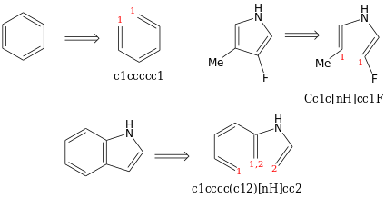

Parsing SMILES
==============

About SMILES
------------

SMILES (simplified molecular input entry system) is a "chemical notation system designed for modern chemical information processing" invented by D. Weininger and then developed by Daylight Chemical Information Systems (simply referred as "Daylight" is most websites).
There is also `an open standard <http://opensmiles.org/opensmiles.html>`_ specification that will be followed here.

A SMILES string is basically a linear representation of a molecule created from a traversal of the molecular graph (in its simplest version, a labeled graph whose vertices are the atoms and edges are the chemical bonds).
This is actually equivalent to the construction of a `spanning tree <https://en.wikipedia.org/wiki/Spanning_tree>`_.
Therefore, many SMILES are possible (including very peculiar ones) for a given molecule (depending, basically on the starting vertex, and on the edges taken during the visit).

Such SMILES string consists of a series of characters, without space.

.. note::

    Complete explanations of the SMILES syntax are provided for example on the `SMILES theory page of Daylight <http://www.daylight.com/dayhtml/doc/theory/theory.smiles.html>`_.
    A small introduction is given in the next sections.

Atoms
_____

The atomic symbol is used to specify an atom, **in square bracket**, except for the atom in the *organic subset*: B, C, N, O, S, P, Cl, Br (plus ``as`` and ``se``, but only in their aromatic form).

+ For the atom outside this organic subset, the number of hydrogen and charge must be specified, e.g. ``[H+]``, ``[Al+3]``, ``[BH3]``, ``[NaH]`` ...
+ For atom in the organic susbet, the number of hydrogen is assumed, in order to match the lowest valence, consistant with explicit bond. Thus,

  + ``C`` represent the methane ;
  + ``Cl`` represent the hydrogen chloride ;
  + ``O`` represent the water molecule ;
  + ...

  To give an explicit count of hydrogen or a charge, square bracket can be used, for example ``[NH4+]`` for the ammonium cation.
+ To differentiate atom that are in an aromatic cycle, those atoms must be lowercase.
  For example, ``c`` is used for the carbon in benzene, instead of ``C``.
  This is only valid for atom in the organic subset, except Br and Cl.

Bonds
_____

Adjacent atoms are assumed to be connected to each other by a single (or aromatic) bond.
Thus ``CCO`` is used to represent ethanol, while ``COC`` stands for dimethyl ether.
Double and triple bonds are explicitly marked, with ``=`` or ``#``, respectively.
The symbol ``-`` can be used for single bond, but is usually implicit.

For example,

+ ``CCC`` represent the propane ;
+ ``C=CC=C`` represent the butene ;
+ ``O=C=O`` stands for carbon dioxyde ;
+ ``CC#N`` represent the acetonitrile.

Branches and cycles
___________________

Branches are given in parentheses, which are linked to the previous atom (to the left).
Parentheses can be nested and stacked.

    Different branched molecules and their corresponding SMILES.

Cycles are represented by cutting one bond in each cycle and "linking" the corresponding two ends through a *ring id*.
For example,

    Different branched cyclic molecule and their corresponding SMILES.
    An atom can be the source (or the destination) of multiple rings, and thus may have multiple *ring id* (see molecule 3).
    Notice that the "cut" is arbitrary.

A last type of bond is useful to represent "disconnected" structures, the dot.
It is used for example to represent a cation-anion pair:

.. figure:: ../images/tuto_disc.png
    :align: center

    The dot is used to represent sodium acetate, which has an ionic bond.

This dot bond assumes that the atoms are not linked together ... Even though they may be trough a common ring id.
Thus, ``C1.C1`` is a valid representation of the ethane.

Molecular configuration
_______________________

In SMILES, one only cares about **local** configuration: even though a carbon may not be assymetric (in the CIP sense), it may present a configuration.
There is therefore **no** correspondence between the configuration in a SMILE string and the absolute configuration in the CIP sense (although if the vertex are given in the correct order in the CIP way, that corresponds to R/S stereo configuration for tetrahedral carbons).
One only cares about the correspondance between the branches given in a certain order, and the "reality" of the structure.

Stereochemistry is defined for any set of 4 atoms that contains at most 1 hydrogen (non-planar) or 2 (planar).
The implementation recognize at least those kind of stereochemistry:

+ Planar stereo config (square planar and cis/trans configuration) ;
+ Non planar stereo config (clockwise/anticlockwise for "asymetric" carbons, allene configuration).

The purpose of this stereo implementation is to match the set of indices *a, b, c and d* (which may be given in any order) with the set *0, 1, 2 and 3*.
The value of the stereo object is the order in which the *a, b, c and d* indices must be read to match *0, 1, 2 and 3*.

For the non planar stereo configuration, there is two possible values: clockwise (``@@``) and counterclockwise (``@``).
For the planar stereo configuration, there is three possible values: ``@SP1`` (shape of a ``U``), ``@SP2`` (``4``) and ``@SP3`` (``Z``).

    The question is always "how to read ``(a,b,c,d)`` so that the sequence matches ``(0,1,2,3)``".

For example,

    All SMILES are equivalent representation of (S)-bromofluorochloromethane (left) and `cisplatin <https://en.wikipedia.org/wiki/Cisplatin>`_ (right)
    Notice that when there is a H, if you precise it with the carbon, it is the first atom from which you start the rotation.

The cis/trans configuration requires two special type of bond: ``\`` and ``/``, which visually represent if the group is "above" or "below" the alkene bond.
This interpretation is **relative to the carbon atom**.

    Exemple of a cis (right, Z) or trans (left, E) configuration. Notice that the two SMILES are equivalent.

About canonical SMILES
______________________

There is therefore many way to make a valid SMILES for a given molecule.
To handle this, people propose canonicalization schemes (rewrite the SMILES string in a way that the output is always the same for a given molecule), that consists in two parts:

1. Renumber the atoms (the vertices of the graph) based on some invariant(s), in a way that is (normally) unique ;
2. Starts by the atom with the lowest number out of the previous step, and perform some branching decision during the exploration (once again, in a *unique* way).

The critical part is actually the first one.
For example, the algorithm developed by D. Weininger in 1989 (CANGEN) fails for some structures.
Currently, there is no canonicalisation scheme available.

Parsing SMILES with ``osmipy``
------------------------------

.. code-block:: python

    from osmipy import parse
    smiles = parse('C1(Cl)CC1')

and that's it !